# G3+ 🎥💻❤
G3+ é uma plataforma de streaming idealizada e criada por <a href="https://github.com/GiovannaRossi">Giovanna Rossi</a>, <a href="https://github.com/Henrique-Git">Henrique Medeiros</a>, <a href="https://github.com/jovimoura">João Victor Moura</a>, <a href="https://github.com/laoliveir">Larissa Oliveira</a> e <a href="https://github.com/WellHarper">Wellerson Silva</a>. O projeto foi feito com HTML, CSS, Java Script e com bibliotecas como Bootstrap e SwiperJs.

## Imagem tela de início G3+💻🚀

## Como foi feito?🤔

O projeto foi divido em duas partes, sendo uma delas a parte de login/cadastre-se e a home e todas as funcionalidades presentes na home.
## Login/Cadastre-se💻📱

A parte de login/cadastre-se foi feita por <a href="https://github.com/Henrique-Git">Henrique Medeiros</a>, que também fez a tela de ínicio, e <a href="https://github.com/laoliveir">Larissa Oliveira</a>. Para fazer ambas as partes foram utilizadas API's de validação de CEP, RG, CPF e etc. E o design responsivo das telas de login/cadastre-se foram feitos pelos dois.

Para ter acesso a home, você pode fazer um login com um email qualquer e qualquer senha, pois G3+ trata-se de um projeto frontend e não possui banco de dados para validar clientes mas é necessário que seja um email, pois o login possui um mecanismo que verifica se o texto digitado possui características de um email.

## Imagens das telas de Login💻
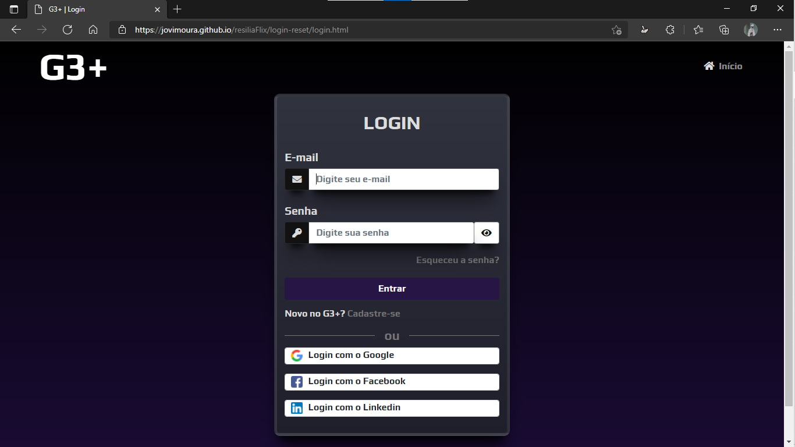

## Imagens das telas de Cadastre-se🚀
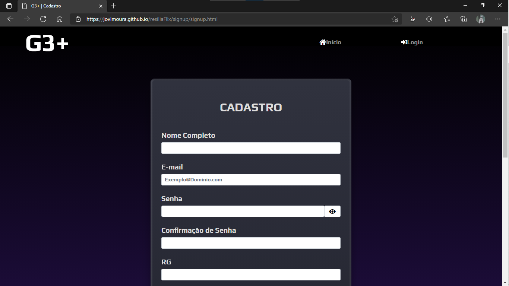
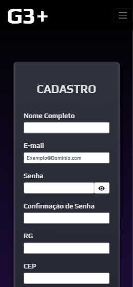

## Home e ferramentas💻🎥

A página de home foi desenvolvida por <a href="https://github.com/GiovannaRossi">Giovanna Rossi</a>, <a href="https://github.com/jovimoura">João Victor Moura</a> e <a href="https://github.com/WellHarper">Wellerson Silva</a>. A tela de home foi divida em três partes, sendo elas a tela de home, onde encontramos cabeçalho, carrosséis, rodapés, barra de pesquisa, login, perfis e etc.

 A parte de perfis foi desenvolvida por <a href="https://github.com/GiovannaRossi">Giovanna Rossi</a> e foi integrada ao cabeçalho.

## Imagem telas de pefil💻📱
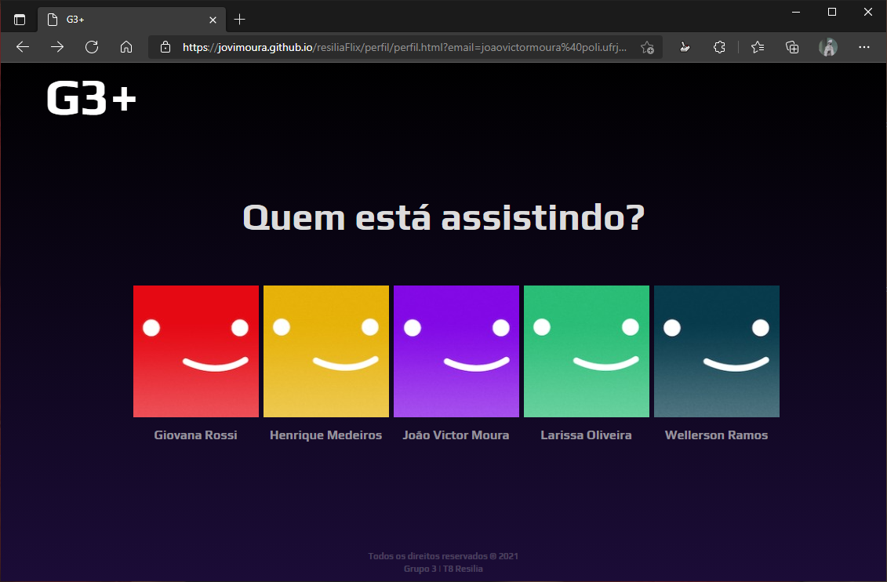
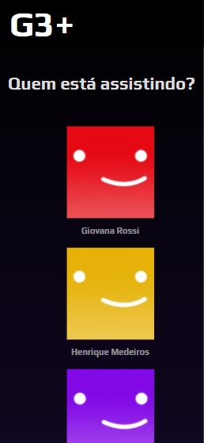

### Home💻

A página de home, foi desenvolvida por <a href="https://github.com/jovimoura">João Victor Moura</a>. Nela foram utilizadas, além de HTML, CSS e Java Script, bibliotecas, sendo elas: Bootstrap (utilizada no banner principal) e SwiperJS (utilizada nos carrosséis).

## Imagens da home📱💻
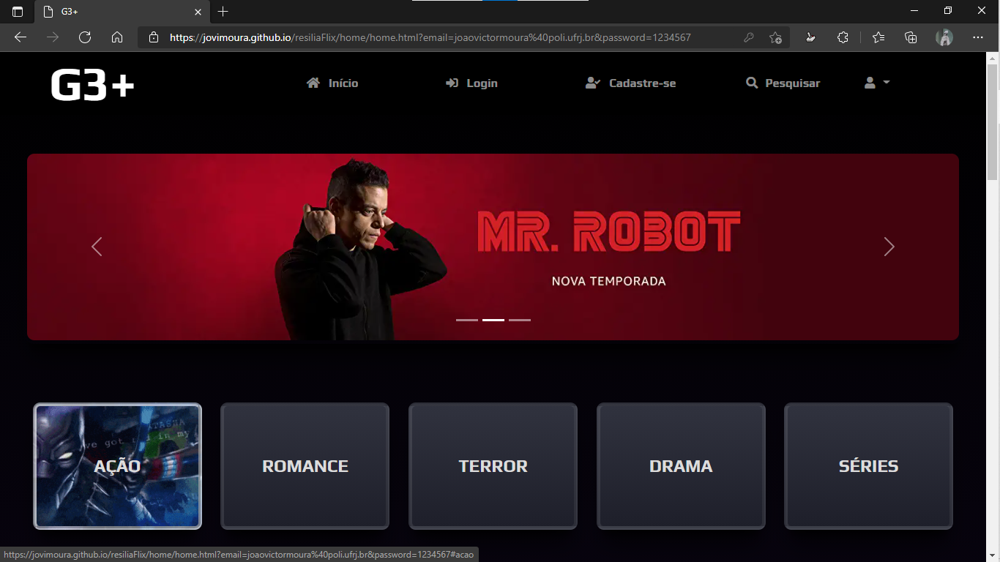
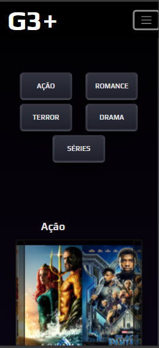

## Ferramenta de Busca e Informações dos filmes🎥🚀

A ferramenta de busca e a de informações foram desenvolvidas por <a href="https://github.com/WellHarper">Wellerson Silva</a>, utilizando uma API vinda do site <a href="https://www.omdbapi.com/">OMDb</a> e Java Script, essa API busca o filme desejado pelo usuário e através do HTML e CSS e manipulação de DOM, criamos uma tela de informações para o filme desejado.

## Imagens da tela de busca💻

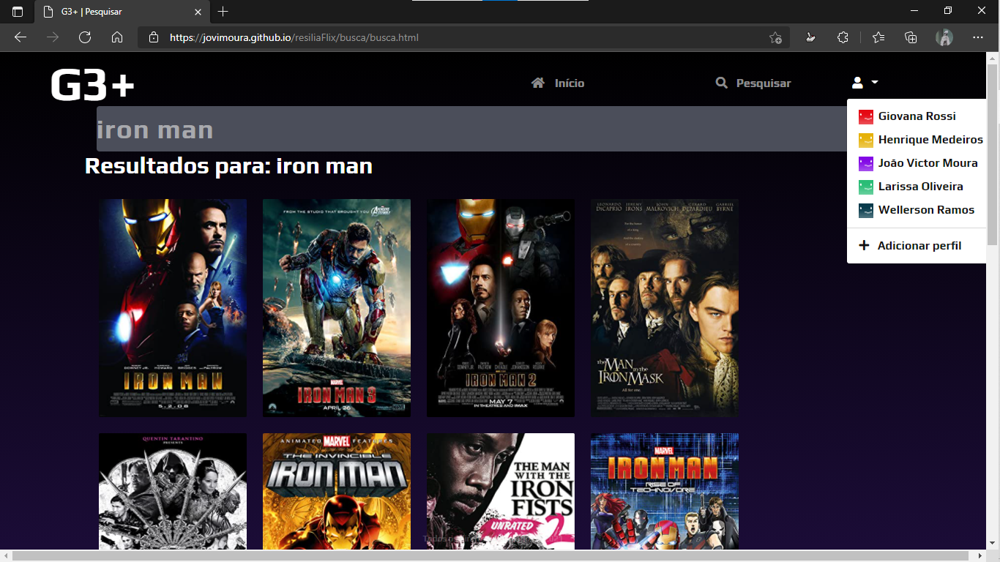
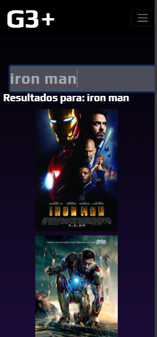

## Imagens da tela de informações📱

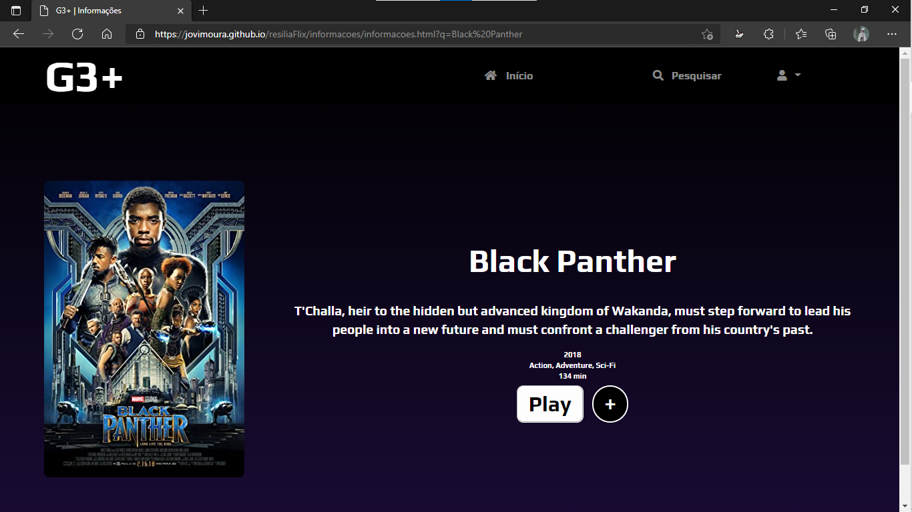
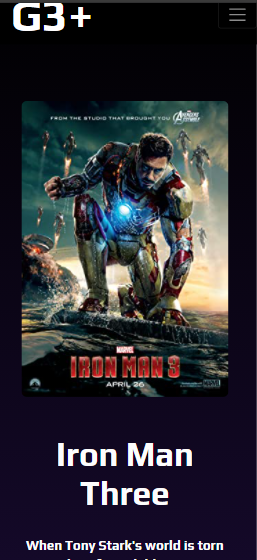

## Tecnologias utilizadas🦉

<ul>
    <li>HTML</li>
    <li>CSS</li>
    <li>Java Script</li>
    <li>Bootstrap</li>
    <li>SwiperJS</li>
</ul>

## Autores😊

### Giovanna Rossi😊
<ul>
    <li><a href="https://github.com/GiovannaRossi">Github</a></li>
</ul>

### Henrique Medeiros🤗
<ul>
    <li><a href="https://www.linkedin.com/in/henrique-neves-medeiros-19320a184/">LinkedIn</a></li>
    <li><a href="https://github.com/Henrique-Git">Github</a></li>
    <li>Email: henrique.nemed@gmail.com</li>
</ul>

### João Victor Moura😎
<ul>
    <li><a href="https://www.linkedin.com/in/jovimoura10/">LinkedIn</a></li>
    <li><a href="https://github.com/jovimoura/">Github</a></li>
    <li>Email: joaovictors.mouraa@gmail.com</li>
</ul>

### Larissa Oliveira😉
<ul>
    <li><a href="https://www.linkedin.com/in/laoliveir/">LinkedIn</a></li>
    <li><a href="https://github.com/laoliveir">Github</a></li>
    <li>Email: laoliveir97@gmail.com</li>
</ul>

### Wellerson da Silva😃
<ul>
    <li><a href="https://www.linkedin.com/in/wellharper/">LinkedIn</a></li>
    <li><a href="https://github.com/WellHarper">Github</a></li>
</ul>